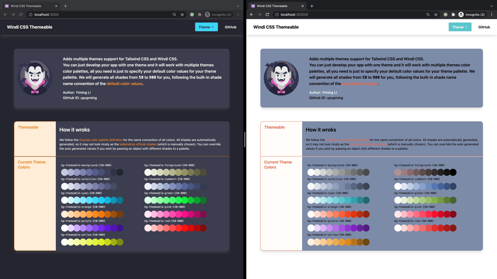

# tailwindcss-themeable

- [tailwindcss-themeable](#tailwindcss-themeable)
    - [Demos](#demos)
    - [Installation](#installation)
    - [Usage](#usage)
    - [Override auto-generated shade values](#override-auto-generated-shade-values)
    - [Customized palette keys](#customized-palette-keys)
    - [Full configurations](#full-configurations)
    - [About shades generating algorithm](#about-shades-generating-algorithm)
    - [Credits](#credits)

Adds multiple themes support for Tailwind CSS and Windi CSS.

You can just develop your app with one theme and it will work with multiple themes color palettes, all you need is just to specify your default color values for your theme pallette. We will generate all shades from `50` to `900` for you, following the built-in shade name convention of the [default color values](https://tailwindcss.com/docs/customizing-colors).



## Demos

| Demo                    | Demo Link                                                            | Source Code                                                          |
| ----------------------- | -------------------------------------------------------------------- | -------------------------------------------------------------------- |
| Tailwind CSS            | https://upupming.site/tailwindcss-themeable/tailwind/                | [examples/tailwind](examples/tailwind)                               |
| Windi CSS               | https://upupming.site/tailwindcss-themeable/windi/                   | [examples/windi](examples/windi)                                     |
| Override shades         | https://upupming.site/tailwindcss-themeable/override-shades/         | [examples/override-shades](examples/override-shades)                 |
| Customized palette keys | https://upupming.site/tailwindcss-themeable/customized-palette-keys/ | [examples/customized-palette-keys](examples/customized-palette-keys) |

## Installation

```bash
npm i -D tailwindcss-themeable
```

## Usage

We define the color palette keys following [the dracula contribute color palette](https://draculatheme.com/contribute).

CSS variables are generated from build time, and added to the corresponding scope for usage.

Configuration:

```ts
// windi.config.ts or tailwind.config.js
import { themeable } from 'tailwindcss-themeable'
// or: const { themeable } = require('tailwindcss-themeable')

plugins: [
    themeable({
      themes: [
        {
          name: 'example-theme',
          palette: {
            // color palette key: hex code
            background: '#282A36',
            foreground: '#F8F8F2',
            selection: '#44475A',
            comment: '#6272A4',
            cyan: '#8BE9FD',
            green: '#50FA7B',
            orange: '#FFB86C',
            pink: '#FF79C6',
            purple: '#BD93F9',
            red: '#FF5555',
            yellow: '#F1FA8C'
          }
        }
      ]
    })
  ]
```

<details>

<summary>Generated CSS</summary>

```css
.themeable-example-theme {
    --themeable-background-50: 121, 126, 156;
    --themeable-background-100: 110, 115, 147;
    --themeable-background-200: 92, 97, 124;
    --themeable-background-300: 75, 78, 101;
    --themeable-background-400: 57, 60, 77;
    --themeable-background-500: 40, 42, 54;
    --themeable-background-600: 16, 17, 22;
    --themeable-background-700: 0, 0, 0;
    --themeable-background-800: 0, 0, 0;
    --themeable-background-900: 0, 0, 0;
    --themeable-background: 40, 42, 54;
    --themeable-foreground-50: 255, 255, 255;
    --themeable-foreground-100: 255, 255, 255;
    --themeable-foreground-200: 255, 255, 255;
    --themeable-foreground-300: 255, 255, 255;
    --themeable-foreground-400: 255, 255, 255;
    --themeable-foreground-500: 248, 248, 242;
    --themeable-foreground-600: 228, 228, 206;
    --themeable-foreground-700: 209, 209, 169;
    --themeable-foreground-800: 189, 189, 133;
    --themeable-foreground-900: 169, 169, 96;
    --themeable-foreground: 248, 248, 242;
    --themeable-selection-50: 159, 162, 183;
    --themeable-selection-100: 147, 151, 174;
    --themeable-selection-200: 124, 129, 156;
    --themeable-selection-300: 103, 108, 136;
    --themeable-selection-400: 86, 89, 113;
    --themeable-selection-500: 68, 71, 90;
    --themeable-selection-600: 44, 46, 58;
    --themeable-selection-700: 20, 21, 26;
    --themeable-selection-800: 0, 0, 0;
    --themeable-selection-900: 0, 0, 0;
    --themeable-selection: 68, 71, 90;
    --themeable-comment-50: 214, 218, 231;
    --themeable-comment-100: 201, 207, 224;
    --themeable-comment-200: 175, 184, 209;
    --themeable-comment-300: 150, 160, 194;
    --themeable-comment-400: 124, 137, 179;
    --themeable-comment-500: 98, 114, 164;
    --themeable-comment-600: 76, 89, 130;
    --themeable-comment-700: 55, 65, 95;
    --themeable-comment-800: 34, 40, 59;
    --themeable-comment-900: 14, 16, 24;
    --themeable-comment: 98, 114, 164;
    --themeable-cyan-50: 255, 255, 255;
    --themeable-cyan-100: 255, 255, 255;
    --themeable-cyan-200: 255, 255, 255;
    --themeable-cyan-300: 219, 248, 254;
    --themeable-cyan-400: 179, 241, 254;
    --themeable-cyan-500: 139, 233, 253;
    --themeable-cyan-600: 84, 223, 252;
    --themeable-cyan-700: 29, 212, 251;
    --themeable-cyan-800: 4, 182, 220;
    --themeable-cyan-900: 3, 136, 165;
    --themeable-cyan: 139, 233, 253;
    --themeable-green-50: 255, 255, 255;
    --themeable-green-100: 239, 255, 243;
    --themeable-green-200: 199, 253, 213;
    --themeable-green-300: 159, 252, 183;
    --themeable-green-400: 120, 251, 153;
    --themeable-green-500: 80, 250, 123;
    --themeable-green-600: 25, 248, 82;
    --themeable-green-700: 6, 212, 58;
    --themeable-green-800: 4, 157, 43;
    --themeable-green-900: 3, 103, 28;
    --themeable-green: 80, 250, 123;
    --themeable-orange-50: 255, 255, 255;
    --themeable-orange-100: 255, 255, 255;
    --themeable-orange-200: 255, 243, 230;
    --themeable-orange-300: 255, 223, 190;
    --themeable-orange-400: 255, 204, 149;
    --themeable-orange-500: 255, 184, 108;
    --themeable-orange-600: 255, 157, 52;
    --themeable-orange-700: 251, 130, 0;
    --themeable-orange-800: 195, 101, 0;
    --themeable-orange-900: 139, 72, 0;
    --themeable-orange: 255, 184, 108;
    --themeable-pink-50: 255, 255, 255;
    --themeable-pink-100: 255, 255, 255;
    --themeable-pink-200: 255, 243, 250;
    --themeable-pink-300: 255, 203, 233;
    --themeable-pink-400: 255, 162, 215;
    --themeable-pink-500: 255, 121, 198;
    --themeable-pink-600: 255, 65, 174;
    --themeable-pink-700: 255, 9, 150;
    --themeable-pink-800: 208, 0, 119;
    --themeable-pink-900: 152, 0, 87;
    --themeable-pink: 255, 121, 198;
    --themeable-purple-50: 255, 255, 255;
    --themeable-purple-100: 255, 255, 255;
    --themeable-purple-200: 255, 255, 255;
    --themeable-purple-300: 236, 224, 253;
    --themeable-purple-400: 213, 186, 251;
    --themeable-purple-500: 189, 147, 249;
    --themeable-purple-600: 157, 94, 246;
    --themeable-purple-700: 124, 41, 243;
    --themeable-purple-800: 96, 12, 216;
    --themeable-purple-900: 72, 9, 163;
    --themeable-purple: 189, 147, 249;
    --themeable-red-50: 255, 255, 255;
    --themeable-red-100: 255, 248, 248;
    --themeable-red-200: 255, 207, 207;
    --themeable-red-300: 255, 167, 167;
    --themeable-red-400: 255, 126, 126;
    --themeable-red-500: 255, 85, 85;
    --themeable-red-600: 255, 29, 29;
    --themeable-red-700: 228, 0, 0;
    --themeable-red-800: 172, 0, 0;
    --themeable-red-900: 116, 0, 0;
    --themeable-red: 255, 85, 85;
    --themeable-yellow-50: 255, 255, 255;
    --themeable-yellow-100: 255, 255, 255;
    --themeable-yellow-200: 255, 255, 255;
    --themeable-yellow-300: 251, 253, 218;
    --themeable-yellow-400: 246, 252, 179;
    --themeable-yellow-500: 241, 250, 140;
    --themeable-yellow-600: 234, 248, 86;
    --themeable-yellow-700: 228, 245, 32;
    --themeable-yellow-800: 196, 212, 9;
    --themeable-yellow-900: 146, 159, 7;
    --themeable-yellow: 241, 250, 140;
}
```

</details>

Then you can wrap you HTML elements with `themeable-example-theme` class to use the `example-theme` theme! All `text-themeable-*`, `bg-themeable-*`, and so on... classes use the CSS variable from the generated CSS of your configuration. `tailwindcss-themeable` already has two built-in themes (`dracula` and `material`) you can use directly.

```html
<div class="themeable-example-theme">
    <div class="text-themeable-foreground bg-themeable-background">
        Hello world!
    </div>
</div>
<div class="themeable-dracula">
    <div class="text-themeable-foreground bg-themeable-background">
        Hello world!
    </div>
</div>
<div class="themeable-material">
    <div class="text-themeable-foreground bg-themeable-background">
        Hello world!
    </div>
</div>
```

Compiled CSS:

```css
.text-themeable-foreground {
  --tw-text-opacity: 1;
  color: rgba(var(--themeable-foreground), var(--tw-text-opacity));
}

.bg-themeable-background {
  --tw-bg-opacity: 1;
  background-color: rgba(var(--themeable-background), var(--tw-bg-opacity));
}
```

## Override auto-generated shade values

As the [tailwindcss docs says](https://tailwindcss.com/docs/customizing-colors#generating-colors):

> Bad news, color is complicated and despite trying dozens of different tools, we’ve yet to find one that does a good job generating these sorts of color palettes. We picked all of Tailwind’s default colors by hand, meticulously balancing them by eye and testing them in real designs to make sure we were happy with them.

Although our shade generating algorithm is okay in most cases, you may still find the auto-generated shades not satisfying. You can specify all (or just a part of) the shades of a color if you want, this will overwrite the auto-generated shade value. Below is an example configuration, you can explore more on the [`override-shades`](examples/override-shades) example:

```js
themeable({
      themes: [
        {
          name: 'theme-example',
          palette: {
            background: {
                // Replace the hex color value with whatever your like
                 '50': '#F9FAFB',
                '100': '#F3F4F6',
                '200': '#E5E7EB',
                '300': '#D1D5DB',
                '400': '#9CA3AF',
                '500': '#6B7280',
                '600': '#4B5563',
                '700': '#374151',
                '800': '#1F2937',
                '900': '#111827',
                DEFAULT: '#6B7280',
            }
            //...
          }
      ]
})
```

## Customized palette keys

You may find the dracula theme's palette key is not satisfying, and you may like some name convention such as `primary`, `secondary`, etc., just like [the material ui does](https://mui.com/customization/palette/). No problem, you can pass any key you want, but be cautious that you must define the `primary` key for all your themes to avoid the problem of missing a color when switching themes. The plugin will log a warning message if you forget some keys in a theme. Below is an example configuration, you can explore more on the [`customized-palette-keys`](examples/customized-palette-keys) example:

```js
themeable({
      themes: [
        {
          name: 'theme-1',
          palette: {
            primary: '#42a5f5'
            //...
          }
        },
        {
          name: 'theme-2',
          palette: {
            // make sure all your themes have your customized keys to avoid problems when switching themes
            primary: '#fcba03'
            //...
          }
        }
      ]
})
```

## Full configurations

This is the type definition of this plugin, you can dive into the source code to see more, all the type definitions are well documented for your convenience. If you have any questions, please fell free to open an issue. And new theme contribution is welcome!

```ts
export interface ThemeableOptions {
  /**
   * Support a list of theme definitions, the user should define the colors of the theme follow the contribute of Dracula theme.
   * See https://draculatheme.com/contribute#color-palette
   * @default []
   */
  themes?: Theme[]
  /**
   * Prefix of the class to enable a theme, for example the container with class `${classPrefix}-dracula` will enable dracula theme in its children elements
   * @default `themeable`
   */
  classPrefix?: string
  /** When not specify any theme in HTML, the `defaultTheme` will be used
   * @default `dracula`
   */
  defaultTheme?: string
  /**
   * This will allow you the change the difference in saturation between each shade of color. By default we use  1.771968374684816 because these are the averages that steps change in tailwind's default colors. Thanks to https://tw-shade-gen.netlify.app/
   */
  saturationFactor?: number
  /**
   * This will allow you the change the difference in lightness between each shade of color. By default we use 7.3903743315508015 because these are the averages that steps change in tailwind's default colors. Thanks to https://tw-shade-gen.netlify.app/
   */
  lightFactor?: number
}
```

## About shades generating algorithm

The shades generating algorithm will find a best shade number (`50`-`900`) for your color, and then generate darker and lighter shades with fixed saturation and lightness step (`saturationFactor` and `lightFactor`).

## Credits

1. Idea of shades generation
    1. https://github.com/dracula/tailwind
    2. https://github.com/nickgraffis/tailwind-color-generator
    3. https://github.com/anheric/tailwindshades
2. Idea of theming
    1. [Theming Tailwind with CSS Variables](https://www.youtube.com/watch?v=MAtaT8BZEAo)
